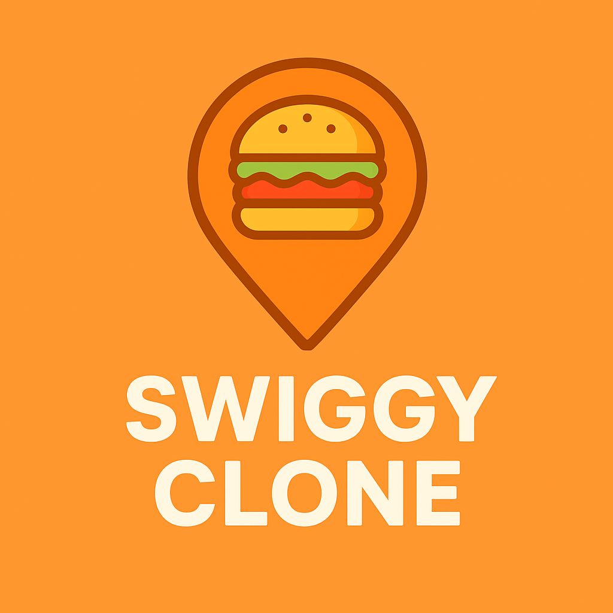

<p align="center">
  
</p>

# 🍔 Swiggy Clone (React + Live API)
.png)
.png)
.png)

A clone of the **Swiggy food delivery app** built using **React.js** and Swiggy’s **Live API**.  
This project replicates Swiggy’s core features such as browsing restaurants, viewing menus, and adding items to the cart.

---

## 🚀 Features
- 🏪 Browse restaurants in real-time using Swiggy’s Live API  
- 📋 View detailed restaurant menus  
- 🛒 Add items to cart and manage orders  
- ⚡ Optimized with React and modern UI components  
- 🔄 Responsive design for desktop and mobile  

---

## 🛠️ Tech Stack
- **Frontend:** React.js, JavaScript, CSS  
- **API:** Swiggy Live API  
- **Build Tool:** Parcel  

---

## 📸 Screenshots
(Add screenshots here later, e.g. homepage, restaurant page, cart page)

---

## 📦 Installation & Setup

Clone the repository and install dependencies:

```bash
git clone https://github.com/your-username/Swiggy-Clone-Using-Live-API.git
cd Swiggy-Clone-Using-Live-API
npm install
npm start
